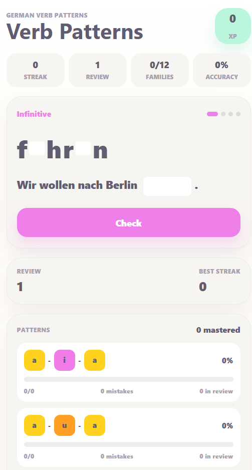

# German Verb Patterns

Mobile-first web app created to help learners practice German verbs through vowel-pattern recognition, with a focus on `Infinitive`, `Simple Past`, and `Past Participle`.



Live project:
[https://german-verb-patterns.vercel.app/](https://german-verb-patterns.vercel.app/)

## About the project

**German Verb Patterns** was built as a portfolio project focused on mobile experience, visual clarity, and active learning. The idea is to turn German verb memorization into a fast, lightweight, and interactive flow, highlighting vowel families and reinforcing pattern recognition.

One of the key aspects of the project is that it is a **PWA (Progressive Web App)**. This means the app can be installed on a phone, opened in full-screen mode, and used with behavior much closer to a native app, which supports the idea of quick and repeated study sessions.

## What the app does

- Trains one verb per round.
- Splits practice into four steps: base form, simple past, past participle, and vowel-pattern identification.
- Saves progress locally with `localStorage`.
- Keeps a review system for missed verbs.
- Shows XP, streak, mastered families, and progress by pattern.
- Was designed for mobile use, with large interactions, instant feedback, and a touch-friendly layout.

## Stack

- React
- Vite
- TypeScript
- PWA with manifest and service worker
- Vercel deployment

## Portfolio highlights

This project showcases:

- mobile-first interface design;
- translation of a language-learning rule into product mechanics;
- local progress persistence in the browser;
- study experience design with gamification;
- packaging as an installable PWA.

## Scripts

```bash
npm run dev
npm run build
npm run lint
npm run preview
```
